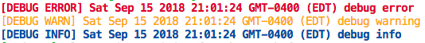

# EZCODIN-LOGGER

This is a very simple logger, that will allow you to console color coded debug statements, in addition to writing to log files. Currently three files are created info, warning, and error. Will be adding features over time. 

Collaboraters welcome, looking forward to some pull requests! 

## Install

```bash
> npm install ezcodin-logger
```
## Setup
##### No Options:
```javascript
const Log = require('ezcodin-logger')

//without callback or Options
let log = new Log()
```
##### With Callback:
```javascript
const Log = require('ezcodin-logger')

//Optional Callback
let log = new Log( result => console.log(result))
```
##### With Options Object:
```javascript
const Log = require('ezcodin-logger')

//Optional Options Object
let options = {
     colors:{
        error: 'red',
        warning: 'yellow',
        info: 'blue'
    },
    filePaths: {
        error: './logs/ez.error.log',
        warning: './logs/ez.warning.log',
        info: './logs/ez.info.log'
    }

}
let log = new Log( options)
```
##### All of the above:
```javascript
const Log = require('ezcodin-logger')

//Optional Options Object
let options = {
     colors:{
        error: 'red',
        warning: 'yellow',
        info: 'blue'
    },
    filePaths: {
        error: './logs/ez.error.log',
        warning: './logs/ez.warning.log',
        info: './logs/ez.info.log'
    }

}

//With Options object and Callback
let log = new Log( options, result => console.log(result.msg)) //console => 'ezcodin-logger initialized'
```
```bash
# available colors: 
'black', 'red', 'green', 'yellow', 'blue', 'magenta', 'cyan', 'white', 'gray', 'redBright',
'greenBright', 'yellowBright', 'blueBright', 'magentaBright', 'cyanBright', 'whiteBright'
```
## Log to Console
```javascript
//debug logger
log.debugError('debug error')
log.debugWarning('debug warning')
log.debugInfo('debug info')
```

## Log to File
Log files are created in the root directory automatically upon instantiating the logger, use the options object to place logs in another location.
```javascript
//Log to file
log.logError('log error')
log.logWarning('log warning')
log.logInfo('log info')
```

## Express example
```javascript
app.use(function (req, res, next) {
    let err = new Error(`${req.ip} tried to reach ${req.originalUrl}, resource not found`);
    err.statusCode = 404;
    log.logInfo(err.statusCode + err.message )
    res.status(err.statusCode).json({ status: err.statusCode, msg: err.message });
}); 

app.use(function(err, req, res, next) {
    if (!err.statusCode) err.statusCode = 500;   
    log.logError(err.statusCode + err.message )
    res.status(err.statusCode).json({ status: err.statusCode, msg: err.message }); 
    }
});
```

