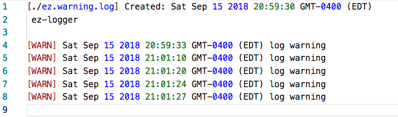

#EZ-LOGGER
This is a very simple logger, that will allow you to console color coded debug statements, in addition to writing to logs to files. Currently three files are created info, warning, and error. Will be adding features over time, collaboraters welcome. 

##Install
```bash
> npm install ez-logger
```

## Log to Console
```javascript
const log = require('./ez-logger')

//Will display provided message in the console
log.debugError('debug error')
log.debugWarning('debug warning')
log.debugInfo('debug info')
```

## Log to File
Log files are created automatically in the root directory, if a logging event is fired.
```
const log = require('./ez-logger')

log.logError('error message to be logged')

log.logWarning('warning message to be logged')

log.logInfo('info message to be logged')
```
 **./ez.warning.log**




